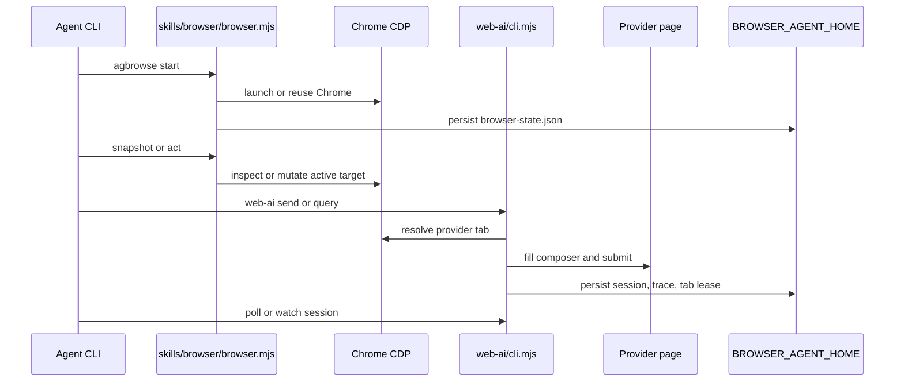

# agbrowse Source Structure

`agbrowse`는 long-running server 없이 Chrome DevTools Protocol에 붙는 짧은 Node CLI다. 사용자는 `agbrowse start`로 Chrome을 띄우고, `snapshot`, `click`, `type`, `web-ai query` 같은 명령을 독립 프로세스로 실행한다. 상태는 `BROWSER_AGENT_HOME` 아래에 저장되고, provider web-AI 세션과 tab lease도 같은 홈을 기준으로 이어진다.

구조를 볼 때 핵심은 세 계층이다. 첫째, `skills/browser/`는 Chrome lifecycle과 일반 browser primitive를 담당한다. 둘째, `web-ai/`는 ChatGPT, Gemini, Grok 웹 UI를 provider별 계약으로 다룬다. 셋째, `test/`, `scripts/`, `devlog/`, `structure/`는 실제 동작을 검증하고 public claim을 제한하는 근거를 남긴다.

개발자는 새 기능을 넣기 전에 이 문서에서 어느 계층에 들어가는지 먼저 정한다. 일반 브라우저 동작이면 `skills/browser/`, provider UI 자동화면 `web-ai/`, 검증 자동화면 `test/`나 `scripts/`, 장기 의사결정이면 `devlog/`에 둔다. `cli-jaw`와 mirror할 때도 같은 기준으로 `.mjs` standalone 표면과 `.ts` server-routed 표면을 나눠 본다.

---

## 현재 구조 스냅샷

마지막 측정: 2026-05-05.

| 경로 | 파일 수 | 라인 수 | 역할 |
| --- | ---: | ---: | --- |
| `bin/` | 2 | 6 | published bin wrapper |
| `skills/browser/` | 8 | 3472 | Chrome lifecycle, CDP connection, refs, tabs, diagnostics |
| `skills/vision-click/` | 3 | 680 | screenshot to coordinate click helper |
| `skills/web-ai/` | 1 | 365 | bundled agent workflow skill |
| `web-ai/` | 69 | 10899 | provider automation, sessions, MCP, eval, policy, trace |
| `web-ai/context-pack/` | 8 | 583 | file selection, token budget, context rendering |
| `web-ai/eval/` | 5 | 362 | offline provider DOM fixture harness |
| `web-ai/policy/` | 4 | 121 | mutation and content-boundary guardrails |
| `web-ai/trace/` | 4 | 202 | trace ID, redaction, report, writer helpers |
| `scripts/` | 4 | 279 | eval runner and release scripts |
| `test/unit/` | 54 | 5681 | deterministic module tests |
| `test/integration/` | 14 | 1485 | CLI, MCP, policy, provider fixture tests |
| `test/e2e/` | 1 | 50 | browser smoke coverage |
| `test/spec/` | 2 | 35 | high-level contract specs |
| `docs/` | 5 | 252 | adoption, trace, production-readiness, comparison, benchmark docs |
| `devlog/` | 61 | 13231 | phased plan, research, implementation notes |

`structure/` 자체는 이 문서가 검증 대상으로 삼는 source tree 밖의 문서 허브라서 위 집계에서 제외한다. `verify-counts.sh`는 이 표의 경로별 파일 수와 라인 수를 live source 기준으로 비교한다.

## 주요 파일

| 파일 | 라인 수 | 설명 |
| --- | ---: | --- |
| `skills/browser/browser.mjs` | 2088 | root CLI parser, Chrome lifecycle, browser primitive commands |
| `skills/browser/tab-manager.mjs` | 371 | CDP target list, create, close, switch |
| `skills/browser/tab-lifecycle.mjs` | 191 | idle cleanup, pinned target, duration parsing |
| `skills/browser/skill-install.mjs` | 280 | bundled skill list/get/install |
| `web-ai/cli.mjs` | 1008 | `web-ai` subcommand parser and command orchestration |
| `web-ai/chatgpt.mjs` | 618 | ChatGPT provider send/poll/query/status |
| `web-ai/gemini-live.mjs` | 620 | Gemini provider send/poll/query/status |
| `web-ai/grok-live.mjs` | 487 | Grok provider send/poll/query/status |
| `web-ai/mcp-server.mjs` | 255 | stdio JSON-RPC MCP bridge |
| `web-ai/tool-schema.mjs` | 114 | MCP and AI SDK schema source |
| `web-ai/answer-artifact.mjs` | 86 | provider poll result artifact normalization |
| `web-ai/source-audit.mjs` | 127 | claim/source coverage audit helper |
| `web-ai/ax-snapshot.mjs` | 235 | compact accessibility snapshot and refs |
| `web-ai/self-heal.mjs` | 384 | deterministic target resolution and validation |
| `web-ai/action-intent.mjs` | 66 | serializable semantic action intent contracts |
| `web-ai/target-resolver.mjs` | 32 | explainable target resolver wrapper |
| `scripts/run-web-ai-eval.mjs` | 51 | provider fixture eval CLI wrapper |
| `scripts/release.sh` | 113 | latest release gate and publish script |
| `scripts/release-preview.sh` | 97 | preview release gate and publish script |

## Runtime Flow

## 모듈 경계

| 계층 | 포함 | 포함하지 않음 |
| --- | --- | --- |
| Browser primitive | CDP connection, tab state, DOM refs, screenshot, console/network, click/type/wait | provider별 prompt contract |
| Web-AI provider | ChatGPT/Gemini/Grok status, send, poll, model selection, copy fallback, session resume | generic desktop/browser launch policy |
| Evidence | trace writer, eval fixtures, contract audit, policy tests | live account entitlement claims |
| Release | test gates, package export, dry-run publish | credential setup, provider subscription validation |

## cli-jaw Mirror 기준

| agbrowse 표면 | cli-jaw 대응 | mirror 방식 |
| --- | --- | --- |
| `skills/browser/browser.mjs` | `bin/commands/browser.ts`, `src/routes/browser.ts`, `src/browser/*` | `.mjs` CLI primitive를 `.ts` HTTP/CLI route로 번역 |
| `web-ai/*.mjs` | `src/browser/web-ai/*.ts` | provider result shape, session ID, trace ID, lease fields를 JSON 호환 유지 |
| `web-ai/tool-schema.mjs` | cli-jaw MCP/AI SDK schema snapshot 또는 import | schema version과 `additionalProperties: false` 유지 |
| `skills/*/SKILL.md` | `cli-jaw/skills_ref/*/SKILL.md` | agent-facing workflow 문구를 같은 기능 라벨로 유지 |
| `structure/` | `cli-jaw/structure/` | 문서 허브, command map, release gate를 프로젝트 크기에 맞게 유지 |

## 변경 기록

- 2026-05-05: 현재 repo 기준 파일 수, 라인 수, 주요 runtime flow, cli-jaw mirror 기준을 추가했다.
